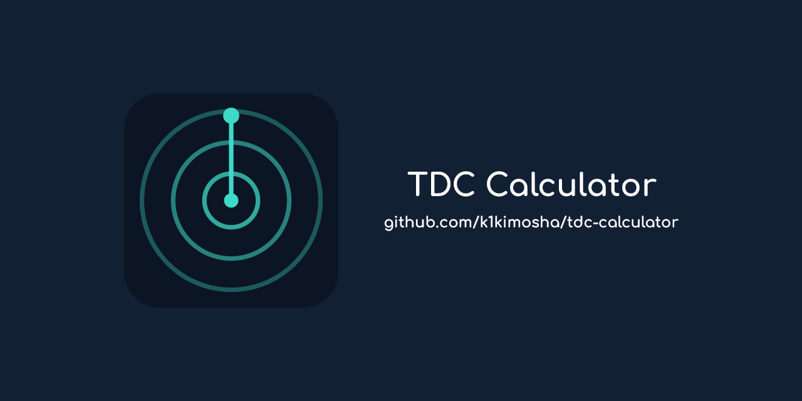

# TDC калькулятор



[English](./README.md)

Веб-калькулятор уставок торпедного компьютера (TDC) для симулятора подводной лодки.
Расчёт дистанции, скорости и курсового угла цели через перископные «риски», метод Дика О'Кейна и вспомогательные параметры стрельбы.

## Возможности

- Интерфейс на русском и английском языках с переключателем в шапке (RU/EN)

**Дистанция**
- Расчёт дистанции по высоте цели: `H × K ÷ риски`
- Кратности прицела: штатная ×1,5 (K = 92,5) и с приближением ×6 (K = 366)
- Ориентир: мачта или труба, выбор корабля из справочника или ручной ввод
- Обратный расчёт (риски по известной дистанции)
- Кликабельная шпаргалка «риски → дистанция»

**Скорость**
- Расчёт скорости цели: `длина ÷ время прохода нос–корма × 1,94`
- Таблица времени прохода для нужной скорости

**КУЦ (курсовой угол цели / AOB)**
- Расчёт КУЦ по видимой длине: `КУЦ = arcsin(Lвидим ÷ Lист)`
- Видимая длина из риски при известной дистанции: `риски × D ÷ 1000`
- Обратный расчёт (риски по КУЦ), выбор борта (Л/П)
- Шпаргалка «КУЦ → риски»

**Метод Дика О'Кейна**
- Угол упреждения: `β = arctan(Vт ÷ Vторпеды)`
- Пеленг на выстрел и КУЦ цели на момент выстрела (`90° − β`)
- Общий случай упреждения: `β = arcsin((Vт ÷ Vs) × sin КУЦ)` и угол встречи
- Время хода торпеды: `D ÷ (Vs × 0,5144)`

**Справочник**
- Параметры военных кораблей (Flower, Bittern, Tribal): длина, мачта/труба, осадка, скорость
- Безопасные дистанции день/ночь (рекомендации, обнаружение, риски)
- Идентификация судов: три способа (расположение трубы/надстройки/фальшбортов, мачт/кранов/трубы, комбинированный)

## Технологии

- [Lit](https://lit.dev/) — веб-компоненты
- [TypeScript](https://www.typescriptlang.org/)
- [Vite](https://vite.dev/) — сборка и dev-сервер

## Сообщество

[Дискорд 1st U-boat Flotilia](https://discord.gg/DGeRx7BY9q)

## Запуск

```bash
npm install
npm run dev      # dev-сервер
npm run build    # production-сборка
npm run preview  # превью собранного проекта
```